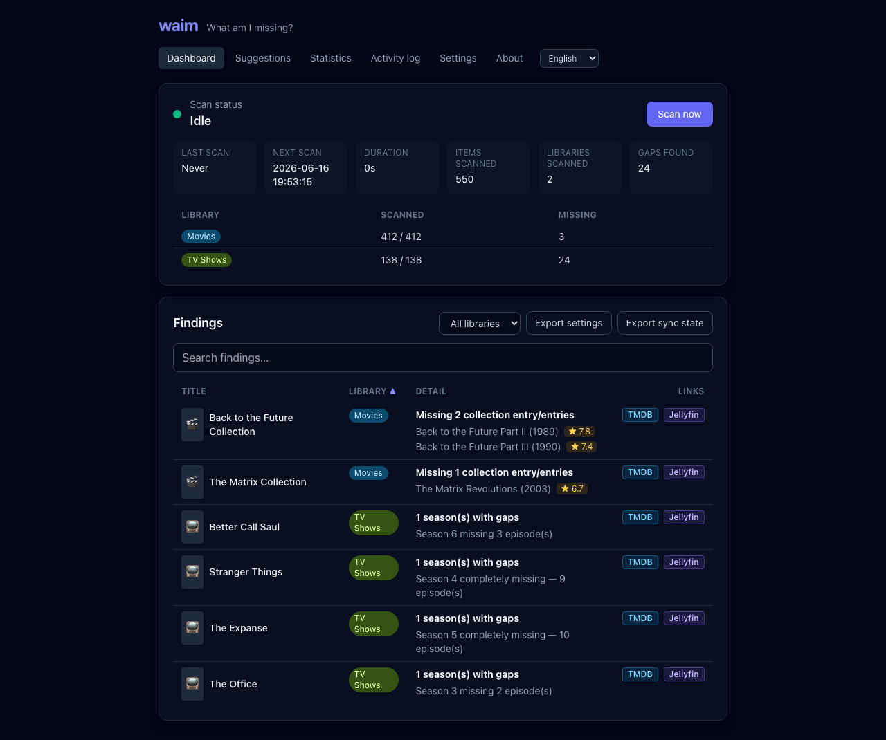
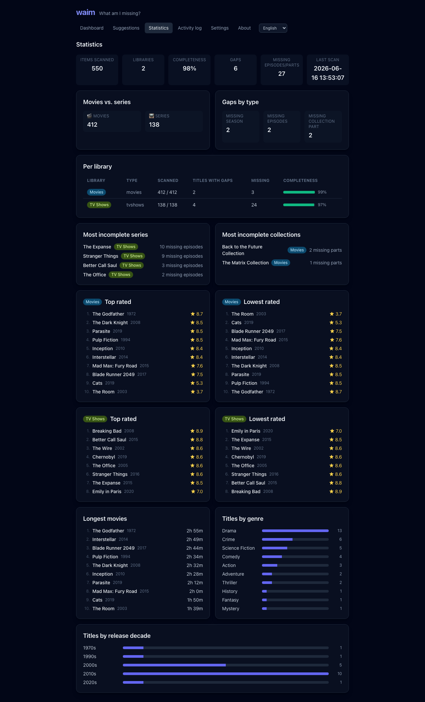
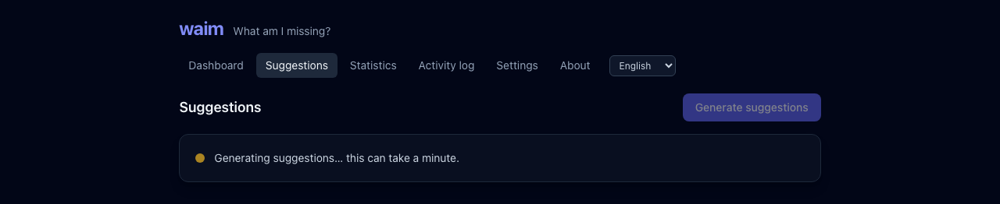
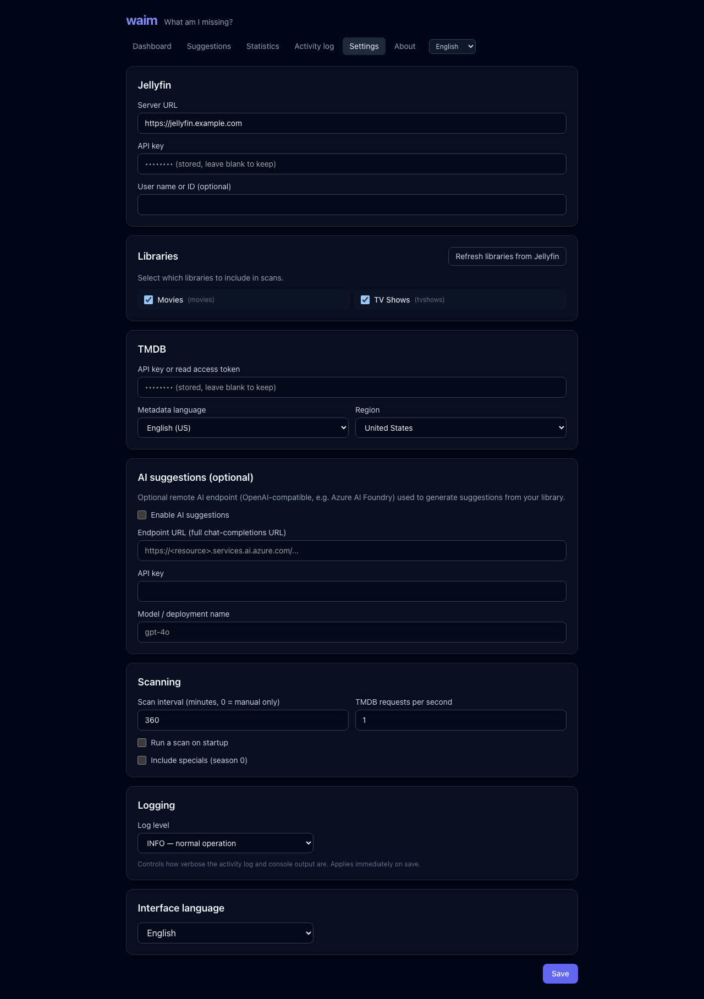
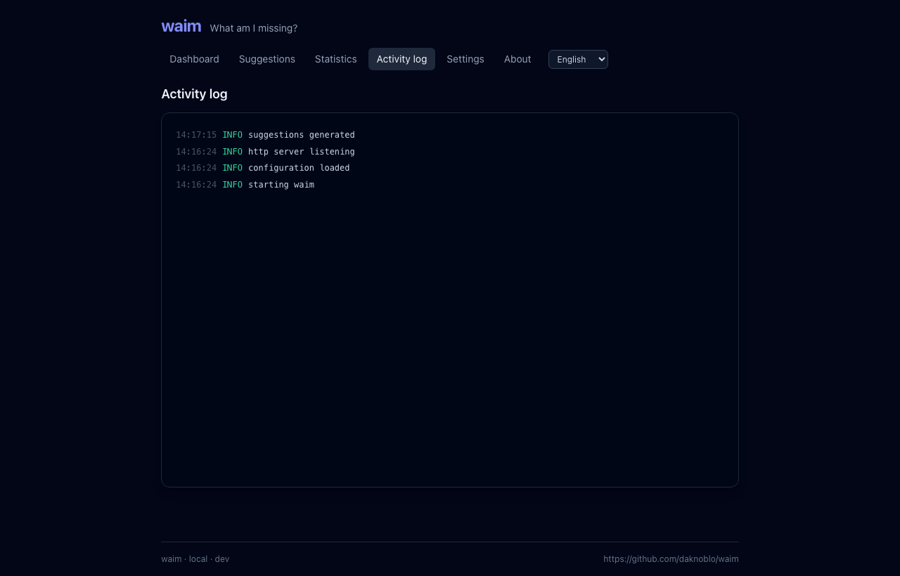
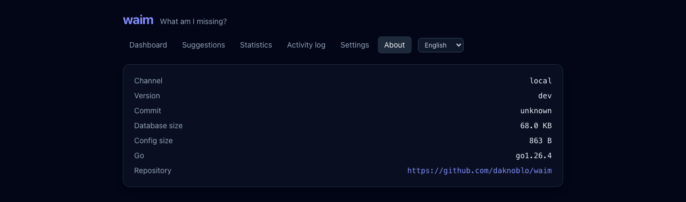

# waim — What Am I Missing?

> [!WARNING]
> **This project is entirely "vibe-coded"** (AI-assisted, without formal QA
> guarantees). Use it at your own risk. See [Disclaimer](#disclaimer).

**waim** connects to your [Jellyfin](https://jellyfin.org/) server, reads your
movies and series, and compares them against
[The Movie Database (TMDB)](https://www.themoviedb.org/) to tell you **what you
are missing**:

- 📺 **Series** — whole seasons that are absent, or individual episodes missing
  from a season you already have.
- 🎬 **Movies & collections** — missing predecessors/sequels or other entries of
  a collection (e.g. owning *The Lord of the Rings* part 1 & 3 but not part 2).

It is a small, single-binary Go application with a modern, server-rendered web
UI (templ + HTMX + Tailwind), built to run in Docker.

The main motivation was the lack of a simple UI to track which episodes or
movies are missing, without extra features — a lightweight alternative to
Huntarr or Missingarr.

---

## Features

- Read-only Jellyfin integration (your library is never modified).
- TMDB matching that prefers Jellyfin's stored provider IDs and falls back to a
  title/year search.
- Detects missing seasons, missing episodes and missing collection entries.
- Periodic scans (configurable interval), scan-on-startup and a manual
  **Scan now** button.
- Per-library selection: choose exactly which Jellyfin libraries to scan.
- Dashboard with grouped findings, sortable columns, a live search box and a
  per-library quick filter.
- **Statistics** page: completeness per library, most incomplete series and
  collections, top/lowest rated titles per library — in separate sections for
  owned media and for missing titles (so you can decide what's worth getting),
  each expandable up to 50 entries — plus genre/decade breakdowns.
- **Suggestions** page: what to watch next from TMDB trending and
  recommendations, with optional AI-generated picks.
- Optional **AI suggestions** via any OpenAI/Azure-compatible chat endpoint.
- Configurable TMDB request rate limit.
- Local TMDB response cache with an incremental background refresher (spread
  across the day) and a nightly cleanup of orphaned entries, so scans and
  suggestions reuse data instead of re-loading everything from TMDB.
- Settings stored as JSON in the data directory; **API keys are encrypted at
  rest** (AES-256-GCM, key derived from `WAIM_MASTER_KEY`).
- Export of settings (keys stay encrypted, never plaintext) and of the current
  sync state.
- Bilingual UI (English / German) with an in-app language switch.
- Activity log and live scan status in the dashboard.
- Stable and dev image channels published to GitHub Container Registry.

## Screenshots

|  |  |
| :--: | :--: |
| **Dashboard** | **Statistics** |
| [](docs/images/dashboard.png) | [](docs/images/statistics.png) |
| **Suggestions** | **Settings** |
| [](docs/images/suggestions.png) | [](docs/images/settings.png) |
| **Activity log** | **About** |
| [](docs/images/logs.png) | [](docs/images/about.png) |

## Quick start (Docker Compose)

```bash
# 1. Create a strong master key (used to encrypt API keys at rest).
echo "WAIM_MASTER_KEY=$(openssl rand -base64 32)" > .env

# 2. Grab the example compose file.
curl -fsSL https://raw.githubusercontent.com/daknoblo/waim/main/deploy/docker-compose.example.yml -o docker-compose.yml

# 3. Start it.
docker compose up -d
```

Then open <http://localhost:8080>, go to **Settings**, and enter your Jellyfin
URL + API key and your TMDB API key. Use **Refresh libraries from Jellyfin** to
load your libraries, select the ones to scan, and save.

### Image channels

| Tag                            | Source branch | Purpose            |
| ------------------------------ | ------------- | ------------------ |
| `ghcr.io/daknoblo/waim:stable` | `main`        | Stable releases    |
| `ghcr.io/daknoblo/waim:dev`    | `develop`     | Development builds |
| `ghcr.io/daknoblo/waim:vX.Y.Z` | git tag       | Pinned versions    |

## Configuration

All runtime configuration is done in the web UI and persisted to `config.json`
in the data directory. Only a few environment variables are needed:

| Variable          | Default        | Description                                           |
| ----------------- | -------------- | ----------------------------------------------------- |
| `WAIM_MASTER_KEY` | *(unset)*      | **Required** to store/decrypt API keys (AES-256-GCM). |
| `WAIM_ADDR`       | `:8080`        | Listen address.                                       |
| `TZ`              | `Etc/UTC`      | Timezone (IANA name) for timestamps and log display.  |

The data directory is fixed at `/app/appdata` inside the container (mount a
volume there to persist it). All other configuration lives in the web UI.

See [docs/configuration.md](docs/configuration.md) for the full settings
reference.

## Security notes

- **No built-in authentication.** waim is meant to run on a trusted network or
  behind a reverse proxy / VPN that provides access control. Do not expose it
  directly to the internet.
- **API keys are encrypted at rest** using a key derived from `WAIM_MASTER_KEY`.
  Without that variable set, keys cannot be stored or read.
- The container runs as a non-root user with a read-only root filesystem and a
  minimal distroless base image.

## Documentation

- [Installation](docs/installation.md)
- [Configuration](docs/configuration.md)
- [Architecture](docs/architecture.md)
- [Development](docs/development.md)

## Tech stack

Go · [templ](https://templ.guide/) · [HTMX](https://htmx.org/) ·
[Tailwind CSS](https://tailwindcss.com/) ·
[modernc.org/sqlite](https://pkg.go.dev/modernc.org/sqlite) (pure-Go, CGO-free) ·
Docker (distroless) · GitHub Actions.

## Disclaimer

This project is **entirely "vibe-coded"** — it was generated with AI assistance
and does not come with formal quality-assurance guarantees or warranty. It talks
to your Jellyfin server in read-only mode and to the TMDB API, but you should
review the code and use it at your own risk.
