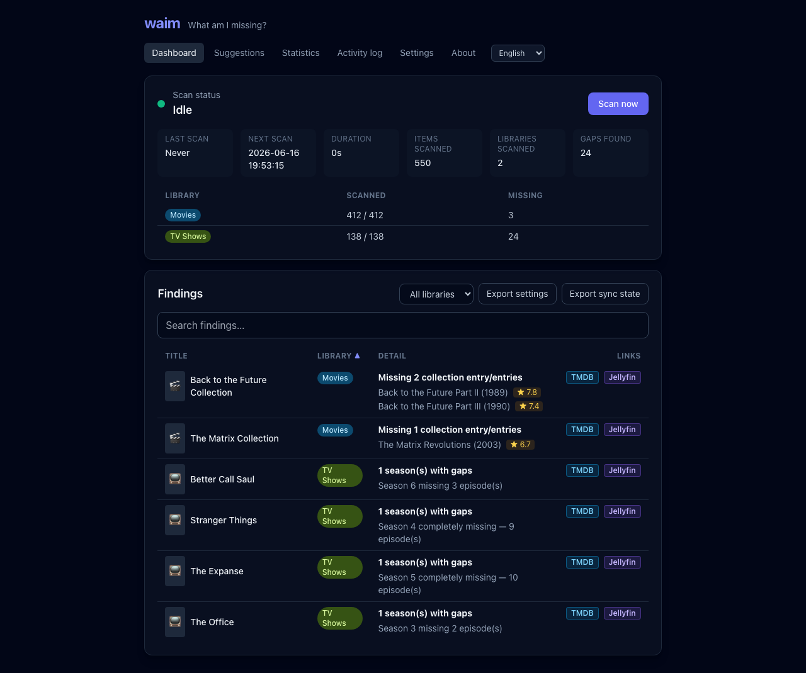
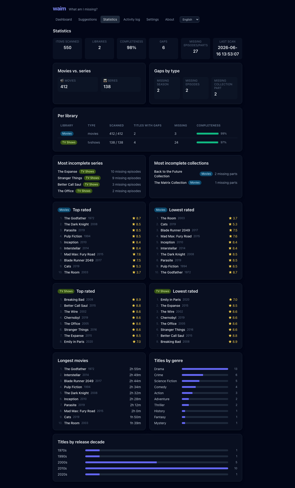
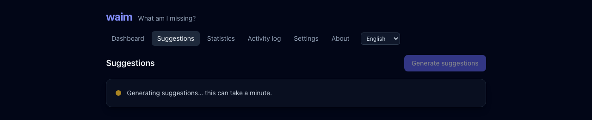
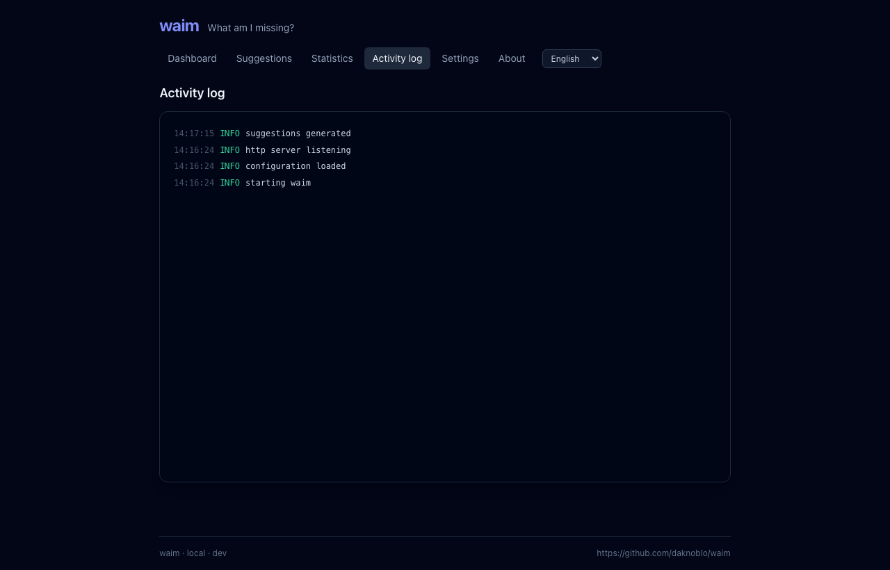
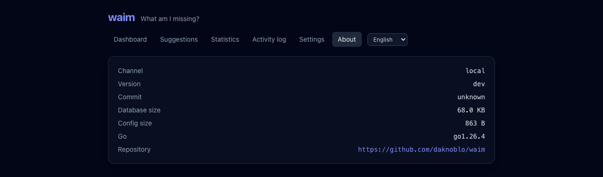

# waim — What Am I Missing?

[](https://daknoblo.github.io/waim/)
[](https://github.com/daknoblo/waim/actions/workflows/ci.yml)
[](https://github.com/daknoblo/waim/releases/latest)
[](go.mod)
[](LICENSE)
[](https://github.com/daknoblo/waim/pkgs/container/waim)

> [!TIP]
> **[Try the live demo →](https://daknoblo.github.io/waim/)** — the real UI
> rendered with sample data, no server required. It is static: nothing is saved
> and no scan runs there.

> [!NOTE]
> This project is built with heavy AI assistance. Every change goes through CI,
> golangci-lint, CodeQL and Dependabot, but it is a personal side project — see
> [Disclaimer](#disclaimer).

**waim** connects to your named [Jellyfin](https://jellyfin.org/) instances, reads your
movies and series, and compares them against
[The Movie Database (TMDB)](https://www.themoviedb.org/) to tell you **what you
are missing**:

- 📺 **Series** — whole seasons that are absent, or individual episodes missing
  from a season you already have.
- 🎬 **Movies & collections** — missing predecessors/sequels or other entries of
  a collection (e.g. owning *The Lord of the Rings* part 1 & 3 but not part 2).

It is a small, single-binary Go application with a modern, server-rendered web
UI (templ + HTMX + Tailwind), built to run in Docker.

The main motivation was the lack of a simple UI to track which episodes or
movies are missing, without extra features — a lightweight alternative to
Huntarr or Missingarr.

---

## Features

- Multiple independent, named, read-only Jellyfin instances (your libraries are never modified).
- A permanent **Virtual collection** with TMDB movie/series search. Add titles
  there or directly from **Suggestions**; already-tracked suggestions link back
  to the collection instead of offering another add action. Removal stays on
  the collection page. Dashboard and statistics have no watch buttons.
  Statistics retain section-level library labels and clickable titles, without
  repeating server-reference badges next to each item. Works with TMDB alone;
  no Jellyfin server is required.
- Global TMDB identity merging and union of real episode ownership across
  instances. Source badges retain every instance and virtual membership.
- Atomic source snapshots: failed refreshes retain the last successful inventory,
  with explicit stale/unknown warnings. Collection edits update immediately and
  queue a cache-backed recalculation, **not** a media-server rescan.
- Watch-only ratings, gaps and releases are separate from real ownership,
  runtime and growth. Plex and Emby adapters are not implemented.
- TMDB matching that prefers Jellyfin's stored provider IDs and falls back to a
  unique exact title/year search; ambiguous/unresolved titles remain source-local.
- Detects missing seasons, missing episodes and missing collection entries.
- Periodic scans with independent intervals per media source, scan-on-startup and a manual
  **Scan now** button.
- Per-library selection: choose exactly which Jellyfin libraries to scan.
- Dashboard with grouped findings, sortable columns, a live search box and a
  per-library quick filter. Library labels use `Type · Address · Library` on one
  line; virtual entries simply show **Virtual collection**, without a repeated
  watch-only note beneath the title. Long labels scroll horizontally on mobile.
  Each finding shows its TMDB link and a media-server link only when that leads
  to a different destination; virtual titles do not repeat the TMDB link.
  The desktop dashboard content is 10% wider to give the findings table more room.
- **Statistics** page: completeness per library, most incomplete series and
  collections, top/lowest rated titles per library — in separate sections for
  owned media and for missing ones (movies *and* series, so you can decide
  what's worth getting), each expandable up to 50 entries.
- **Coming up** section: announced episodes of the series you own and
  unreleased entries of your movie collections, on a release timeline plus a
  poster grid grouped by timeframe. Collected during the regular scan, so it
  costs no extra TMDB requests. Switch it to **Already released** to look
  back at what came out while your library still does not have it.
- General statistics: library facts (total runtime, average rating, episode
  completeness, specials share), biggest sagas and series binge times,
  genre/decade donut charts, rating distribution, original language and
  production country, average rating per genre, growth per scan, a season
  completion heatmap and a sankey chart of episodes per season for any series.
- **Suggestions** page: what to watch next from TMDB trending and
  recommendations, upcoming releases matching your most-watched genres and
  theatrical/on-air releases for your region, with optional AI-generated picks.
- Optional **AI suggestions** via any OpenAI/Azure-compatible chat endpoint.
- Configurable TMDB request rate limit.
- Local TMDB response cache with an incremental background refresher (spread
  across the day) and a nightly cleanup of orphaned entries, so scans and
  suggestions reuse data instead of re-loading everything from TMDB.
- Settings stored as JSON in the data directory; **API keys are encrypted at
  rest** (AES-256-GCM with a key generated on first start). The settings page
  groups settings into **Media management**, **Metadata**, **Interface** and
  **Other**. Global fields autosave within their own tab; source-specific forms
  use explicit saves, revision checks, connection tests and library refreshes.
- A guarded **Danger Zone** can reset metadata, imported inventories or all user
  state. Resets reject active work instead of cancelling it, never delete media
  on your servers, and keep the persistent encryption key and database file.
- Export of settings (keys stay encrypted, never plaintext) and of the current
  sync state.
- Bilingual UI (English / German) with an in-app language switch.
- **Responsive layout**: on phones the navigation collapses into a menu button
  and wide tables turn into stacked cards.
- **Live activity** above the log window, with separate cards for scan/recompute,
  cache maintenance and suggestions. Source connection/discovery work appears
  when used. The dashboard retains its existing live scan status.
- Multi-arch images published to GitHub Container Registry.

## Reading live activity

The activity panel polls every two seconds, independently of the three-second
log refresh. Unchanged partials return HTTP 204; progress never replaces the log
window. No extra upstream requests are made to measure progress.

The ring and remaining percentage apply **only to the current phase**, not the
whole job or the other workers. Metadata evaluation counts unique catalog titles,
not duplicated library memberships; identity resolution counts the current
catalog before newly resolved identities are merged. Cache refresh counts the
actual selected batch; trending counts feeds and recommendations count sampled
owned titles. Inventory (including library/episode pages), persistence, upcoming
discovery and the pending AI response are explicitly indeterminate.

Processed counts include failed/skipped units; diagnostic counts span the run
and a skipped title can also contribute a warning. Identity-resolution skips are
not counted again when metadata evaluation reaches the same unresolved title.
Stale source fallback,
unresolved titles and metadata failures finish **with warnings**, never as fully
verified success. Cancellation and failure are separate outcomes. Initial missing
TMDB configuration shows **Waiting for setup**; the global setup banner links to
settings without repeating setup instructions in each activity card.

Activity is process-local: one bounded running/latest entry per logical job,
not a persisted history. Concurrent source connection requests show the latest
request; old handles cannot overwrite a newer run. Logs and persisted scan
history remain available. Titles/source names are bounded, while metadata paths
are allowlisted and exclude every query string, credential and response body.

Open **Logs → Warnings, skipped titles & errors**, or follow an activity counter,
to see concrete subjects, phases and safe reason descriptions. Repeated events
are deduplicated; each job retains at most 100 details and the combined view is
also capped at 100, with errors first and an explicit truncation notice. Older
counter-only attempts say that details are unavailable rather than inventing
reasons. Known persisted scan/source warnings are localized; unknown legacy
warning bodies are replaced by an explicit safe fallback notice.

The diagnostic expander is outside the two-second activity swap. Its contents
poll independently and unchanged details return 204, so reading/expanded state
does not reset as progress advances. A small circled exclamation after
**About** (beside the menu button on mobile) links to
`/logs#diagnostics`: amber means warnings,
skipped/incomplete work, and red takes precedence for failures or storage errors.
Operational inventory/legacy/pending notices now live in Logs, not repeated
page-wide banners. Metadata/media-source setup cards and key-recovery guidance
remain separate; statistics still mark unverified results as uncertain.
Suggestion lookup and AI diagnostics also stay in Logs and the header indicator,
without an additional raw-error banner above the available recommendations.

The header reads only small persisted status/version rows on each poll, plus
in-memory activity. Warning payloads are cached until the scan/source/config
version changes; it does not build the catalog or make upstream API requests.
Saved warnings and failed/unfinished scans survive restart. A retry retains its
previous issue indication until it finishes; a later completed attempt replaces
that job's issues, and later successful scans replace saved scan warnings/errors.
Old ring-buffer log entries alone do not latch the indicator. Full reset also
clears the diagnostic cache and retained activity details.

A newer, fully verified scan retires earlier unresolved-title warnings from
Suggestions, including persisted warnings after restart. Cards, counters,
diagnostic details and the header use the same reconciled status; the suggestion
cache itself is not regenerated or erased. Independent API/AI errors, truncated
diagnostics and still-unconfirmed scans are not treated as resolved. The card
notes when a newer scan resolved old title-matching warnings. That confirmation
is persisted so an unrelated later outage does not revive the old warning.

Successfully completed activity cards show a green **OK**. Tasks that have never
run remain **Ready**, rather than claiming a verified success.

The interface language is configured exclusively under **Settings → Interface**.
It applies to all pages and clients, including partial updates. The header has
no separate language selector; old browser language cookies no longer override
the saved setting. TMDB metadata language and region remain separate settings.

## Suggestions cache

Suggestions are saved in SQLite and restored after restarts and image updates.
Opening the page shows the existing results immediately. Normal scans and
virtual-collection edits no longer discard them; titles newly present in real
media sources are filtered from cached TMDB recommendations using the live
catalog, without new upstream requests.

A background worker refreshes suggestions every 12 hours, even with no browser
open. It checks once per minute, and the interval starts at the latest attempt.
The **Refresh** button at the top right starts an additional update; repeated
clicks cannot create overlapping jobs. Actual refreshes fetch current TMDB
recommendation data instead of reusing indefinitely cached API responses.

Saved results remain visible while an update is running. Failed refreshes keep
the previous results; diagnostics remain in Logs and the header indicator,
including after restart. Failures do not trigger retries on every page visit:
retry manually or wait for the next scheduled attempt. The timestamp below the
cards shows when the displayed results were generated.

Changes to TMDB/AI configuration invalidate incompatible cached text and start
a fresh generation on the next visit or background check. Metadata, media and
factory resets clear both the in-memory and persisted suggestion cache.

## Screenshots

Prefer clicking around? The **[live demo](https://daknoblo.github.io/waim/)**
serves these pages with sample data.

|  |  |
| :--: | :--: |
| **Dashboard** | **Statistics** |
| [](docs/images/dashboard.png) | [](docs/images/statistics.png) |
| **Suggestions** | **Settings** |
| [](docs/images/suggestions.png) | [](docs/images/settings.png) |
| **Activity log** | **About** |
| [](docs/images/logs.png) | [](docs/images/about.png) |

## Quick start (Docker Compose)

```bash
# 1. Grab the example compose file.
curl -fsSL https://raw.githubusercontent.com/daknoblo/waim/main/deploy/docker-compose.example.yml -o docker-compose.yml

# 2. Start it.
# Docker creates the named data volume; no root user override is needed.
docker compose up -d
```

Then open <http://localhost:8080> and enter your TMDB API key on **Settings → Metadata**.
Use **Virtual collection** immediately, or add Jellyfin instances on **Settings →
Media management**. Sources appear in a two-column tile grid (one column on
phones), with the permanent virtual collection first. Open a real source's
dialog to edit its connection, libraries and scan interval, run a source-only
scan, refresh libraries, test access or remove it. The add button below the
settings opens a provider-selection dialog: Jellyfin is available; Emby and Plex
are marked as not yet available. Adding a source automatically loads its
libraries and opens its dialog so you can select the ones to scan.
**Scan now** refreshes all active real sources; watch edits only recalculate
using saved snapshots.

The virtual collection marks titles that are fully available in your active
media sources and offers manual removal of the virtual entry. Movies need real
ownership; series need every episode released so far, using the union of active
libraries and the configured specials setting. Future episodes do not prevent
completion, and unreleased-only series are not marked complete. Removing a
virtual entry never deletes media-server files or the title's real membership.
Nothing is removed automatically.

The status uses persisted, verified scan results, not just episode-count
equality. Failed metadata/source reads, pending changes, a newer failed scan or
newly due known episodes cannot produce a confirmed complete status. Older
scans without this assessment need one new scan/recalculation. A clean result
is required; unrelated unresolved-title warnings also keep completeness
unconfirmed, consistent with WAIM's existing inventory uncertainty rules.

Existing sources automatically inherit their former global scan interval.
Each source then keeps its own schedule; 0 disables its periodic scans (manual
and startup scans remain available). Recalculations and other sources' scans
leave its deadline unchanged. Changing a source's interval rearms that source;
the dashboard shows the earliest scheduled source deadline. Nightly
cache cleanup stays at 03:00 local time across daylight-saving changes.

> **Upgrading from 1.3 or older?** The encryption key is now generated
> automatically, so API keys stored by those older versions have to be
> entered once more. See
> [Upgrading](docs/installation.md#upgrading-from-13-or-older).

### Image tags

| Tag                            | Source        | Purpose                       |
| ------------------------------ | ------------- | ----------------------------- |
| `ghcr.io/daknoblo/waim:latest` | `main`        | Approved stable build         |
| `ghcr.io/daknoblo/waim:dev`    | `develop`     | Development build for testing |
| `ghcr.io/daknoblo/waim:X.Y.Z`  | tag on `main` | Pinned stable version         |
| `ghcr.io/daknoblo/waim:X.Y`    | tag on `main` | Patch of a stable minor line  |
| `ghcr.io/daknoblo/waim:sha-…`  | `main`        | Commit-specific stable build  |
| `ghcr.io/daknoblo/waim:sha-dev-…` | `develop`  | Commit-specific dev build     |

Development happens on `develop`. Only a maintainer-approved pull request
merged into `main` updates `:latest` and the public demo; publishing waits for
CI to pass. Every new version tag, including patches, creates a stable GitHub
Release and must point to a commit already on `main`. Version tags do not move
`:latest` backwards.

Use `:latest` or a pinned version for normal use. Test `:dev` with a **separate
data volume**: development versions may migrate the database or configuration
in ways an older stable version cannot read. See [development](docs/development.md)
for the promotion and release workflow.

## Configuration

All runtime configuration is done in the web UI and persisted to `config.json`
in the data directory. Only a few environment variables are needed:

| Variable          | Default        | Description                                           |
| ----------------- | -------------- | ----------------------------------------------------- |
| `WAIM_ADDR`       | `:8080`        | Listen address.                                       |
| `WAIM_DATA_DIR`   | `/data` (image), `./appdata` (local) | Persistent data directory. |
| `TZ`              | `Etc/UTC`      | Timezone (IANA name) for timestamps and log display.  |

The container uses `/data`; the Compose example mounts a Docker-managed named
volume there and uses the image's non-root user (UID/GID 65532). A host bind
mount `./appdata:/data` remains an optional alternative. Older images used `/appdata`
inside the container; see the [migration instructions](docs/installation.md#upgrading-the-container-data-path)
before updating an existing deployment. All other configuration lives in the web UI.

See [docs/configuration.md](docs/configuration.md) for the full settings
reference.

## Security notes

- **No built-in authentication.** waim is meant to run on a trusted network or
  behind a reverse proxy / VPN that provides access control. Do not expose it
  directly to the internet.
- **API keys are encrypted at rest** with AES-256-GCM. The key is generated on
  first start and stored as `master.key` in the data directory, so a backup of
  that directory is as sensitive as the keys themselves. Losing the file means
  the stored API keys have to be entered again.
- The container runs as a non-root user with a read-only root filesystem and a
  minimal distroless base image.

## Documentation

- [Installation](docs/installation.md)
- [Configuration](docs/configuration.md)
- [Architecture](docs/architecture.md)
- [Development](docs/development.md)

## Contributing

Bug reports, ideas and pull requests are welcome — see
[Contributing](.github/CONTRIBUTING.md) for the development setup and the
conventions this project follows. Participation is governed by the
[Code of Conduct](.github/CODE_OF_CONDUCT.md).

Run `make coverage` for cross-package Go statement coverage. Reports under
`coverage/` include both the full codebase and handwritten code excluding
generated `*_templ.go` files, so template boilerplate does not obscure the
application's test coverage. These are coverage measurements, not a substitute
for behavior tests or the JavaScript navigation tests in CI.

Found a security problem? Please report it privately as described in the
[Security Policy](.github/SECURITY.md) rather than in a public issue.

## Tech stack

Go · [templ](https://templ.guide/) · [HTMX](https://htmx.org/) ·
[Tailwind CSS](https://tailwindcss.com/) ·
[modernc.org/sqlite](https://pkg.go.dev/modernc.org/sqlite) (pure-Go, CGO-free) ·
Docker (distroless) · GitHub Actions.

## Disclaimer

This project is developed with heavy AI assistance and validated by CI,
golangci-lint, CodeQL and Dependabot on every change. It is still a personal
side project rather than a supported product: it talks to your Jellyfin server
in read-only mode and to the TMDB API, and it is provided as-is, without
warranty — see [LICENSE](LICENSE).


## License

Released under the [MIT License](LICENSE).
