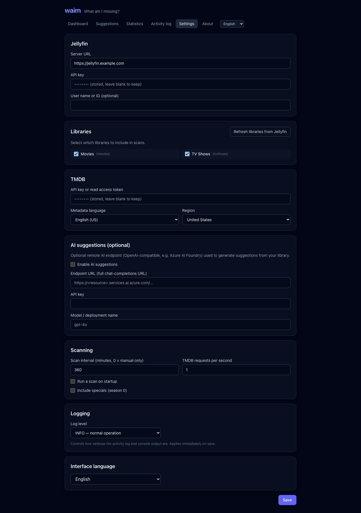

# Configuration

> This project is "vibe-coded" (AI-assisted). Review before relying on it.

All settings are managed in the web UI (**Settings** page) and persisted to
`config.json` inside the data directory. API keys are **always stored
encrypted** and never written in plaintext. The encryption key is generated on
first start and kept as `master.key` next to `config.json`.

## `config.json` schema

```jsonc
{
  "schemaVersion": 2,
  "locale": "en",              // default UI language: "en" or "de"
  "logLevel": "info",          // log verbosity: "info", "warn" or "debug"
  "jellyfin": {
    "url": "https://jellyfin.example.com",
    "apiKeyEnc": "<base64>",   // AES-256-GCM ciphertext (never plaintext)
    "userId": ""               // optional; auto-resolved if empty
  },
  "tmdb": {
    "apiKeyEnc": "<base64>",   // AES-256-GCM ciphertext (never plaintext)
    "language": "en-US",
    "region": "US"
  },
  "ai": {
    "enabled": false,          // enable AI-generated suggestions
    "endpoint": "",            // full chat-completions URL (OpenAI/Azure-compatible)
    "apiKeyEnc": "<base64>",   // AES-256-GCM ciphertext (never plaintext)
    "model": ""                // model / deployment name
  },
  "scan": {
    "intervalMinutes": 60,     // 0 disables periodic scans (manual only)
    "runOnStart": true,        // scan once on container startup
    "tmdbRateLimitRps": 1,     // TMDB requests per second
    "includeSpecials": false,  // include season 0 / specials in comparisons
    "episodeRatings": false    // collect per-episode ratings for the statistics
  },
  "cache": {
    "refreshEnabled": true,        // run the background TMDB cache refresher
    "refreshIntervalMinutes": 15,  // minutes between refresh batches
    "refreshPercent": 1,           // percent of oldest entries refreshed per batch
    "cleanupEnabled": true,        // prune orphaned entries once a night
    "cleanupMaxAgeDays": 30        // remove entries unused for this many days
  },
  "libraries": [
    { "id": "...", "name": "Movies", "type": "movies", "enabled": true }
  ]
}
```

## Settings reference



### Jellyfin

| Field    | Description                                                                 |
| -------- | --------------------------------------------------------------------------- |
| Server URL | Base URL of your Jellyfin server, e.g. `https://jellyfin.example.com`.     |
| API key  | Created under Jellyfin → Dashboard → API Keys. Used read-only.               |
| User ID  | Optional. If empty, the first available user is used for library queries.   |

### TMDB

| Field           | Description                                                            |
| --------------- | --------------------------------------------------------------------- |
| API key / token | A TMDB v3 API key **or** a v4 read access token. Format auto-detected. |
| Metadata language | TMDB language code, e.g. `en-US`, `de-DE`.                           |
| Region          | Optional region code used to bias search results, e.g. `US`, `DE`.    |

> **Token format detection:** a credential starting with `eyJ` (a JWT) is sent
> as a `Bearer` token (v4); anything else is sent as the `api_key` query
> parameter (v3). You only ever need to paste the single key TMDB gives you.

### AI suggestions (optional)

On the **Suggestions** page waim can ask an OpenAI/Azure-compatible chat endpoint
for extra recommendations based on your library. This is entirely optional and
turned off by default.

| Field                 | Description                                                       |
| --------------------- | ---------------------------------------------------------------- |
| Enable AI suggestions | Master switch for the AI integration.                            |
| Endpoint URL          | The full chat-completions URL (e.g. an Azure AI Foundry deployment). |
| API key               | Stored encrypted, like the Jellyfin and TMDB keys.               |
| Model                 | Model / deployment name to request.                              |

### Scanning (Jellyfin)

When and how waim reads your Jellyfin libraries.

| Field                  | Description                                                              |
| ---------------------- | ------------------------------------------------------------------------ |
| Scan interval (minutes) | How often a scan starts automatically. One scan is a single pass over all enabled libraries; `0` means only the *Scan now* button starts one. |
| Run a scan on startup  | Trigger one scan when the container starts.                              |
| Include specials (season 0) | When enabled, specials count as gaps and appear in the statistics; off by default. |

### TMDB requests & data refresh

Everything that talks to TMDB. Responses are cached locally in `waim.db`
(`tmdb_cache` table), so scans and suggestions reuse data instead of re-fetching
everything. A background job keeps the cache fresh by re-fetching the oldest
entries first, and a nightly cleanup (03:00) prunes entries no longer used by any
scan or suggestion.

| Field                          | Description                                                                                          |
| ------------------------------ | ---------------------------------------------------------------------------------------------------- |
| TMDB requests per second       | Upper bound for **all** TMDB calls together (scans, suggestions, background refresh). The settings page previews the resulting requests per minute and hour while you type. |
| Collect episode ratings        | Loads every season of every series from TMDB so the statistics page can show the episode rating heatmap and exact series runtimes. The first scan takes noticeably longer (one request per season, bounded by the rate limit); afterwards the responses come from the local cache. Off by default. |
| Refresh cached TMDB data       | Master switch for the background refresher.                                                          |
| Refresh interval (minutes)     | How often a refresh batch runs.                                                                      |
| Share refreshed per run (%)    | Percentage of the oldest cache entries re-fetched each run. The defaults (1% every 15 min) spread a full refresh across the day. The settings page previews the request volume and how long a full refresh takes. |
| Remove orphaned entries nightly | Master switch for the nightly cleanup.                                                              |
| Remove entries unused for (days) | Cache entries not requested by any scan or suggestion for this many days are deleted (e.g. media removed from the library). |

### Libraries

Use **Refresh libraries from Jellyfin** to load your current libraries, then tick
the ones you want included in scans. Only enabled libraries are scanned.

### Interface language

Switch between English and German. The choice is stored per browser (cookie) and
the default is taken from `config.json`.

### Logging

The **Log level** setting controls how verbose both the in-app activity log and
the console (container) output are. It is applied immediately on save:

| Level   | Shows                                              |
| ------- | -------------------------------------------------- |
| `info`  | Normal operation (default).                        |
| `warn`  | Warnings and errors only.                          |
| `debug` | Verbose, detailed diagnostics (per-request, etc.). |

The log level is configured only here — there is no environment variable for it.
Until `config.json` is loaded at startup, waim logs at `info` level.

## Matching logic

- For each Jellyfin movie/series, waim prefers the **TMDB provider ID** stored
  by Jellyfin. If none is present, it falls back to a TMDB **title + year**
  search and uses the best match.
- **Series:** the TMDB season list is compared against the episodes present in
  Jellyfin. A season with no local episodes is reported as a *missing season*;
  a partially present season is reported as *missing episodes*. Only episodes
  that have already aired are counted.
- **Movies/collections:** if a movie belongs to a TMDB collection, waim lists
  the collection's parts that you do not own (and that have already been
  released).

## Exports

- **Export settings** — downloads `config.json` with API keys still encrypted.
  Plaintext keys are never exported, so the file is only usable on an instance
  that has the matching `master.key`.
- **Export sync state** — downloads the latest successful scan and its findings
  as JSON. This contains no secrets.
